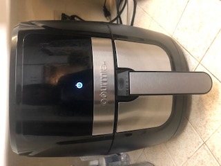
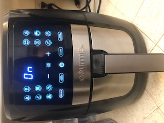
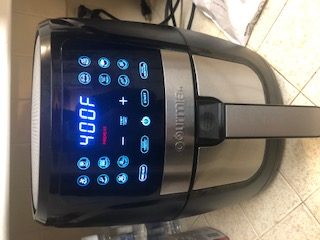
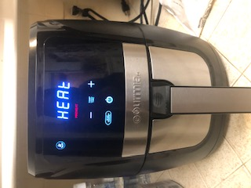
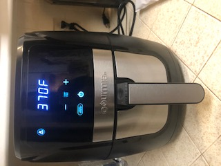
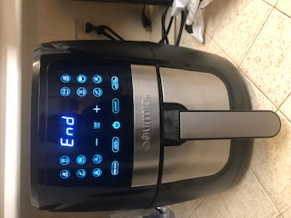

# UX Journal Entry 1 – Air Fryer

#### Felicia Cruz 
#### March 4th, 2021

### Description of Interaction
I decided to make some totinos pizza rolls for dinner, so the piece of technology I decided to document my interaction with is an air fryer. I plugged in the air fryer and a light turned on which looked like a power button so I pushed the button.

 

After I pushed the button a lot of button options turned on and I looked for the best option for me to use to cook my pizza rolls. 

 

I clicked on the air fry button and the screen changed showing preheat showing 400 degrees Fahrenheit and the screen kept flashing and not changing.

The air fryer wasn’t doing anything and didn’t start preheating so I decided to look at the manual. I learned that it said to click on the preheat button to enable/disable, 
so I clicked on the preheat button and preheat went away so I clicked it again and the preheat showed up again on the screen. Then the directions told me after it says preheat 
on the screen to click on the start button, so I did that and the air fryer started preheating. 

I knew that air fryer was done preheating when it started beeping and said to add food on the screen, so I pulled out the air fryer tray and added in my pizza rolls. Unfortunately, after they were cooking for a couple of minutes I found out that from my mom I didn’t set the correct temperature and time for the pizza rolls. I had left the default settings, and had left the temperature set at 400 degrees and the time set to 20 minutes. So I was able to fix the temperature and time and set it to 370 degrees and to 8 minutes by clicking on the temp/time button and using the – and + buttons on the screen. 

Halfway through the cook time I pulled out the tray and shook around the pizza rolls and then placed them back in the air fryer. When the pizza rolls were done cooking the air fryer made a beeping sound and said the word end on the screen. 

I pulled out the tray and took out the pizza rolls and placed them on a plate.

### Usability Goals
After reflecting on my experience using the air fryer I was able to draw conclusions of the air fryer’s strengths and weaknesses and relate them to some of our usability goals we have learned in class. I feel that a strength of the air fryer is that it is a very **useful**, it can be used to cook food to all sorts of different foods such as chicken wings, fries, vegetables, frozen foods, and much more. In addition, the air fryer has many different cooking settings such as air fry, bake, broil, reheat, roast, keep warm, and dehydrate. All of these features that come with the air fryer make it extremely **useful**. A weakness I found while using the air fryer was that since it was my first time using it I found it to be pretty confusing. I didn’t find the air fryer to be very **learnable** because I couldn’t figure out how to get the air fryer to start preheating, therefore, I needed to look at the manual to figure out how to do it. So I did find the air fryer to be a little difficult to use and not very **learnable**, however, over time if I keep using it I think I will be able to learn it over time and not have to refer to the directions. 
