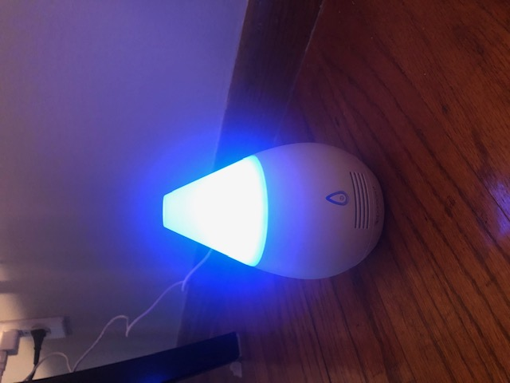
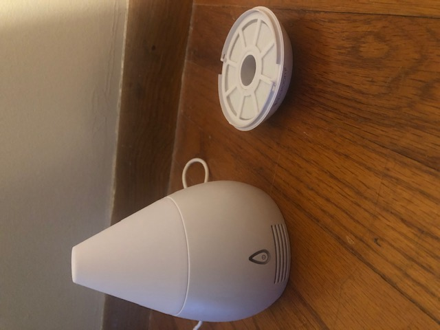
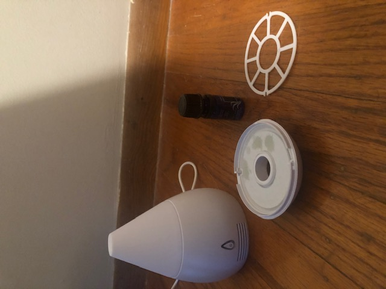
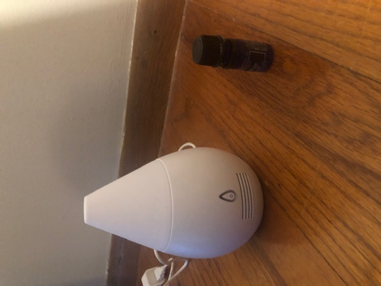
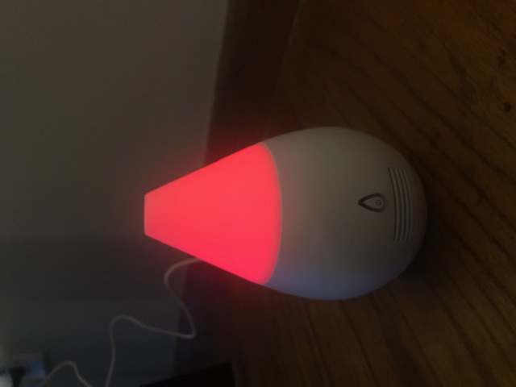
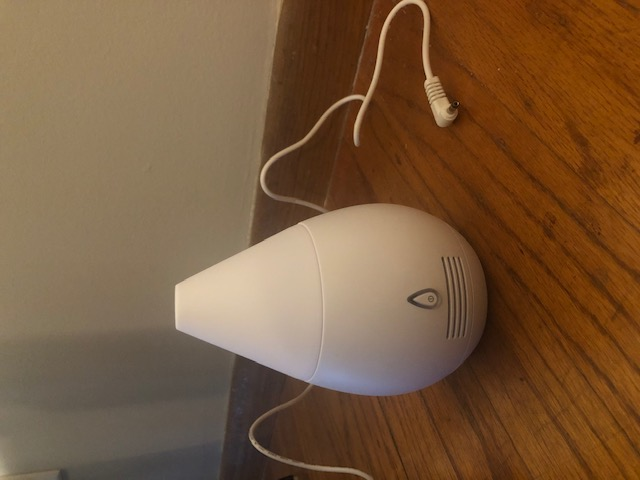

# UX Journal Entry 2 – Essential Oil Fan Diffuser

#### Felicia Cruz 
#### April 27th, 2021

### Description of Interaction

## Overview
I decided to try using my Mom's essential oil diffuser that she got as a Christmas gift. I have never used one before so I thought I would try using it and document my interaction 
using an essential oil fan diffuser.

## Steps
First thing I did was plug in the diffuser and pressed the power button. After I turned on the diffuser the top of it started changing colors.

Afterwards, I decided to start reading the directions because I wasn't sure what to do next and started following the directions.The directions said to make sure the diffuser was unplugged before pulling off the bottom of the diffuser.

After I pulled off the bottom off the bottom of the diffuser, I removed the top plastic cover that was on top of the absorbing pad and added 5 drops of the essential oil(orange
scent) to the absorbing pad. I added 5 drops of the oil because I wasn't sure how many to add and the instructions didn't tell me how many I should add.

I placed the cover back on top of the absorbing pad and then reconnected the bottom back to the diffuser.

I plugged the diffuser back in and I couldn't smell anything so I decided to add 10 more drops of the oil.

After that I could smell the orange fragrance more, but it was really intense. When I was done using the diffuser I pushed the power button and unplugged it.

